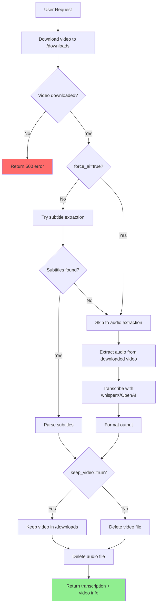
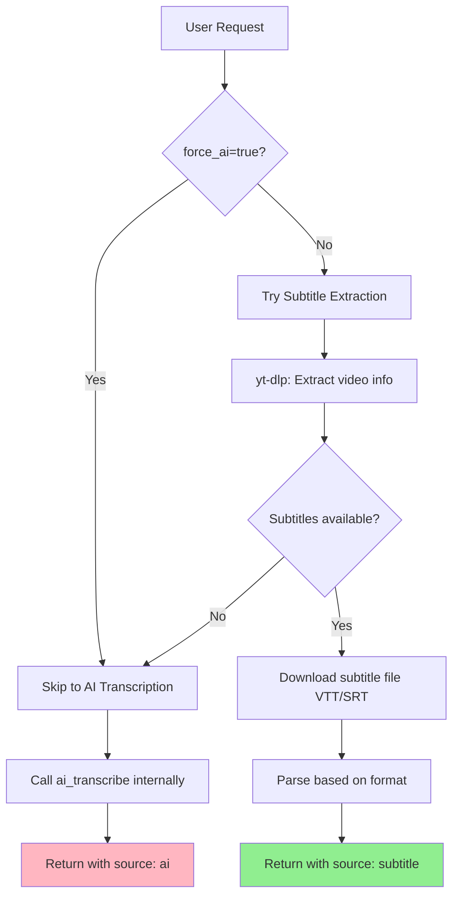
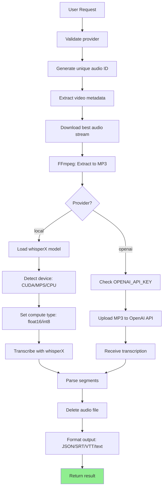
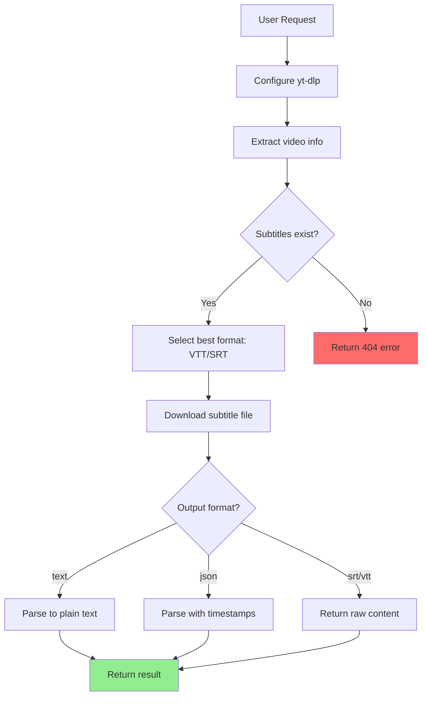
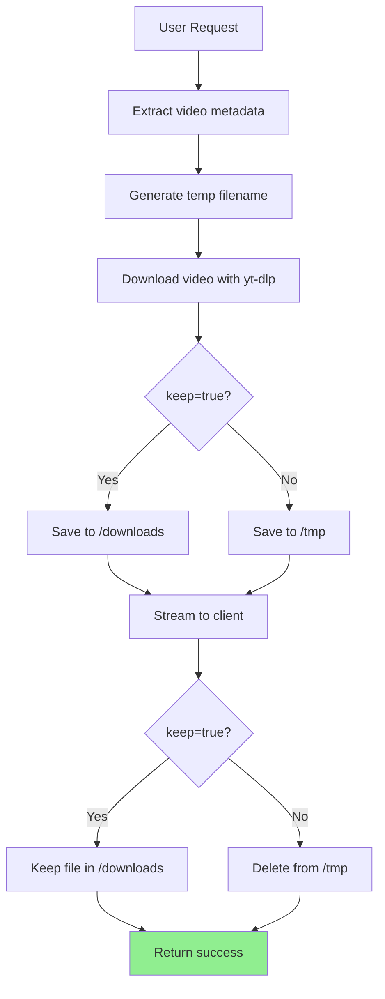

# API Endpoint Flow Diagrams

Visual flow diagrams and step-by-step logic for each API endpoint.

## Table of Contents
- [Download and Transcribe (All-in-One)](#download-and-transcribe-all-in-one) ⭐ NEW
- [Smart Transcribe (Hybrid)](#smart-transcribe-hybrid)
- [AI Transcribe](#ai-transcribe)
- [Subtitle Extraction](#subtitle-extraction)
- [Download Video](#download-video)

---

## Download and Transcribe (All-in-One)

**Endpoint:** `POST /download-and-transcribe`
**Location:** `main.py:1170-1600`
**Purpose:** Download video to server, transcribe it, optionally keep or delete files

### Flow Diagram



### Step-by-Step Logic

1. **Download video to server** (`main.py:1210-1259`)
   - Download to `/downloads/` directory (always persistent during process)
   - Get video metadata (title, duration)
   - Store actual file path and size
   - **Benefit:** File available for retries without re-downloading

2. **Try subtitle extraction first** (`main.py:1261-1375`) - if `force_ai=False`
   - Same logic as `/smart-transcribe`
   - Check for manual/auto-generated subtitles
   - If found → Parse and prepare result
   - If not found → Continue to Step 3

3. **Extract audio from downloaded video** (`main.py:1377-1411`) - if needed
   - Use yt-dlp + FFmpeg to extract audio from LOCAL video file
   - Process `file:///path/to/video.mp4` instead of streaming URL
   - Convert to MP3 in `/tmp/`
   - **Key difference from /ai-transcribe:** Uses already-downloaded video

4. **AI transcription** (`main.py:1413-1562`)
   - Local (whisperX) or OpenAI provider
   - Same error handling as `/ai-transcribe`
   - Comprehensive error messages for troubleshooting

5. **Cleanup based on keep_video parameter** (`main.py:1564-1571`)
   - **If `keep_video=True`:** Keep video in `/downloads/`, delete audio
   - **If `keep_video=False`:** Delete both video and audio
   - Always cleanup on error

6. **Return response with video info** (`main.py:1573-1582`)
   ```json
   {
     "title": "Video Title",
     "segments": [...],
     "source": "subtitle" or "ai",
     "video": {
       "downloaded": true,
       "kept_on_server": true/false,
       "file_path": "downloads/VIDEO-title.mp4" or null,
       "file_size": 52428800,
       "format": "best[height<=720]"
     }
   }
   ```

### Use Cases

| Scenario | Parameters | Result |
|----------|------------|--------|
| **Archive + transcribe** | `keep_video=true` | Video saved in `/downloads/`, transcription returned |
| **Transcribe only** | `keep_video=false` | Transcription returned, all files deleted |
| **Force AI** | `force_ai=true, keep_video=true` | Skip subtitles, use AI, keep video |
| **Retry transcription** | Use kept video file path | Can retry without re-downloading |

### Error Handling

All errors include detailed messages:

**Download errors:**
```json
{"detail": "Video download failed or file not found"}
```

**Audio extraction errors:**
```json
{"detail": "Failed to extract audio from downloaded video"}
```

**AI transcription errors:**
- Local provider: `"Local provider error: Out of memory..."`
- OpenAI provider: `"OpenAI API error (HTTP 429): Rate limit exceeded"`
- Network: `"OpenAI provider error: Connection failed - ..."`

**Automatic cleanup on error:** Both video and audio files deleted if any step fails

---

## Smart Transcribe (Hybrid)

**Endpoint:** `POST /smart-transcribe`
**Location:** `main.py:886-1090`
**Purpose:** Intelligent transcription that tries free subtitles first, falls back to AI

### Flow Diagram



### Step-by-Step Logic

1. **Cleanup old files** (`main.py:913`)
   - Remove old transcription files from `/tmp/`

2. **Check force_ai flag** (`main.py:918`)
   - If `force_ai=True` → Skip to Step 6
   - If `force_ai=False` → Continue to Step 3

3. **Configure yt-dlp for subtitles** (`main.py:921-927`)
   ```python
   ydl_opts = {
       'writesubtitles': True,
       'writeautomaticsub': auto,  # Include auto-generated?
       'skip_download': True,       # Don't download video
       'subtitleslangs': [language]
   }
   ```

4. **Extract video metadata** (`main.py:933-936`)
   - Get title, duration
   - Get available subtitles (manual + auto-generated)

5. **Check subtitle availability** (`main.py:940-954`)
   - Try requested language first
   - Fall back to English variants if not found
   - If found → Download and parse → Return (Step 5a)
   - If not found → Continue to Step 6

6. **Fall back to AI transcription** (`main.py:1072-1082`)
   - Call `ai_transcribe()` endpoint internally
   - Pass all parameters through
   - Return AI transcription result

**Return Fields:**
- `source`: "subtitle" or "ai" (indicates which method was used)
- `source_format`: "vtt" or "srt" (only for subtitles)
- `provider`: "local" or "openai" (only for AI)

---

## AI Transcribe

**Endpoint:** `POST /ai-transcribe`
**Location:** `main.py:647-884`
**Purpose:** AI-powered transcription using whisperX or OpenAI

### Flow Diagram



### Step-by-Step Logic

1. **Validate provider** (`main.py:668-674`)
   - Must be "local" or "openai"
   - Raise 400 error if invalid

2. **Generate unique audio filename** (`main.py:679-681`)
   - Format: `/tmp/{uuid}.mp3`
   - Example: `/tmp/a1b2c3d4.mp3`

3. **Extract video metadata** (`main.py:683-691`)
   - Use yt-dlp with `skip_download=True`
   - Get title and duration (no download yet)

4. **Download and extract audio** (`main.py:693-723`)
   - yt-dlp downloads best audio stream
   - FFmpeg converts to MP3 (192 kbps)
   - Saves to `/tmp/{uuid}.mp3`

5. **Transcribe based on provider** (`main.py:730-807`)

   **If provider="local":**
   - Import whisperX and torch (`main.py:733-739`)
   - Detect device: CUDA → MPS → CPU (`main.py:741-750`)
   - Set compute type: GPU=float16, CPU=int8 (`main.py:742-750`)
   - Load model with specified size (`main.py:753-758`)
   - Transcribe audio (`main.py:761-762`)
   - Extract segments with timestamps (`main.py:765-771`)

   **If provider="openai":**
   - Check for OPENAI_API_KEY (`main.py:775-779`)
   - POST to OpenAI Whisper API (`main.py:783-792`)
   - Parse response segments (`main.py:801-807`)

6. **Cleanup audio file** (`main.py:811-813`)
   - Delete MP3 immediately after transcription
   - Also deleted on error (`main.py:874-875`)

7. **Format output** (`main.py:815-870`)
   - JSON: Full metadata + segments + text
   - SRT: SubRip format with timestamps
   - VTT: WebVTT format
   - Text: Plain text only

**Error Handling:**
- Audio extraction fails → 500 error (`main.py:719-723`)
- Provider not installed → 500 error (`main.py:735-739`)
- OpenAI API fails → Returns status code + error message (`main.py:794-798`)

---

## Subtitle Extraction

**Endpoint:** `GET /transcription`
**Location:** `main.py:1092+`
**Purpose:** Extract existing subtitles from videos (no AI)

### Flow Diagram



### Step-by-Step Logic

1. **Configure yt-dlp** (similar to smart-transcribe Step 3)
   - Enable subtitle writing
   - Set language preference
   - Skip video download

2. **Extract subtitles**
   - Get manual subtitles first (higher quality)
   - Fall back to auto-generated if needed
   - Try language variants (en, en-US, en-GB)

3. **Download subtitle content**
   - HTTP GET request to subtitle URL
   - Receive VTT or SRT file content

4. **Parse based on format**
   - **text**: Remove timestamps, return plain text
   - **json**: Extract segments with start/end times
   - **srt/vtt**: Return raw subtitle file

**Error Cases:**
- No subtitles available → 404 error
- Download fails → 500 error

---

## Download Video

**Endpoint:** `GET /download`
**Location:** `main.py:200-400` (approximate)
**Purpose:** Download video and optionally save to server

### Flow Diagram



### Step-by-Step Logic

1. **Extract metadata**
   - Get video title, duration, formats
   - No download yet

2. **Download video**
   - Use specified format (e.g., best, 720p)
   - Save to temp location

3. **Handle keep parameter**
   - `keep=false` (default): Use `/tmp/`, delete after streaming
   - `keep=true`: Save to `/downloads/`, persist on server

4. **Stream to client**
   - Set Content-Disposition header with filename
   - Stream file bytes
   - Client receives video file

5. **Cleanup**
   - If `keep=false`: Delete from `/tmp/`
   - If `keep=true`: Keep in `/downloads/`

---

## Error Response Format

All endpoints return consistent error responses:

```json
{
  "detail": "Descriptive error message"
}
```

### Common Error Codes

| Code | Meaning | Common Causes |
|------|---------|---------------|
| 400 | Bad Request | Invalid parameter, unsupported format |
| 401 | Unauthorized | Missing or invalid API key |
| 404 | Not Found | No subtitles available, video not found |
| 500 | Internal Server Error | yt-dlp failed, AI provider failed, file I/O error |

### AI Transcription Error Examples

**whisperX not installed:**
```json
{
  "detail": "whisperX not installed. Run: pip install whisperx OR use cloud provider (openai)"
}
```

**OpenAI API Key missing:**
```json
{
  "detail": "OPENAI_API_KEY not configured in environment variables"
}
```

**OpenAI API error:**
```json
{
  "detail": "OpenAI API error: {actual_error_from_openai}"
}
```

**Audio extraction failed:**
```json
{
  "detail": "Failed to extract audio from video"
}
```

---

## Quick Reference Table

| Endpoint | Method | Use Case | Cost | Speed |
|----------|--------|----------|------|-------|
| `/download-and-transcribe` | POST | **Best for archival** - Download + transcribe + keep/delete | $0 or varies | Slower (downloads first) |
| `/smart-transcribe` | POST | **Recommended** - Quick transcription without downloading | $0 or varies | Fast (if subtitles) |
| `/ai-transcribe` | POST | Force AI transcription (no download) | $0 (local) or $0.36/hr (openai) | 2-180s |
| `/transcription` | GET | Only extract existing subtitles | $0 | <1s |
| `/download` | GET | Download video file only (no transcription) | $0 | Varies |

---

## Related Documentation

- [Composable Workflows Guide](./composable-workflows.md) - Platform-specific workflow examples and best practices
- [Clean API Architecture](./clean-api-architecture.md) - Single responsibility principle and endpoint design
- [Transcription Services Guide](./transcription-services.md) - Provider comparison and features
- [Transcription Setup Guide](./transcription-setup-guide.md) - Installation and configuration
