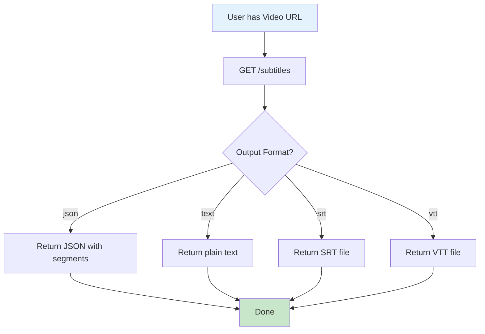
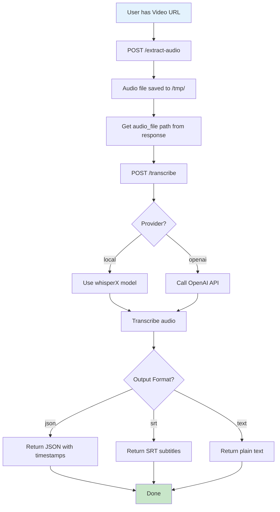
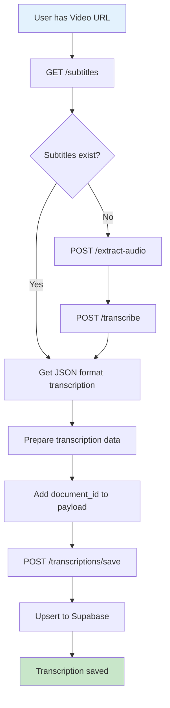
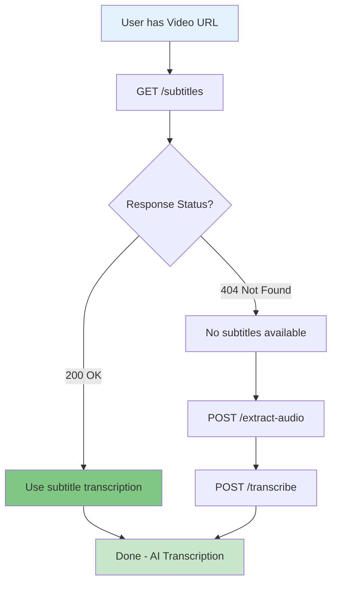
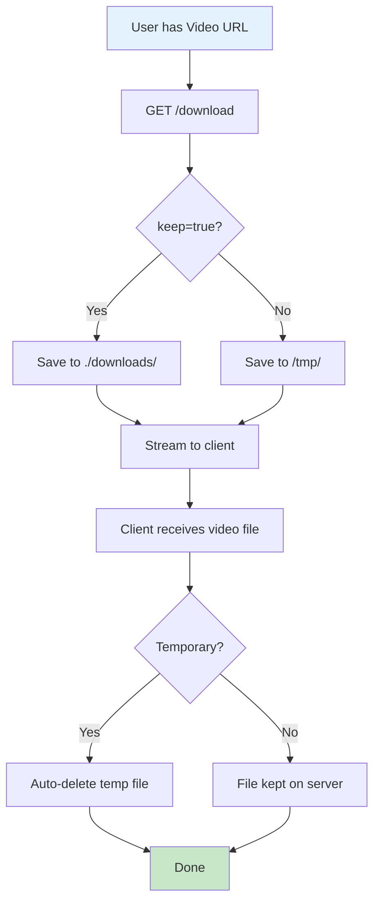
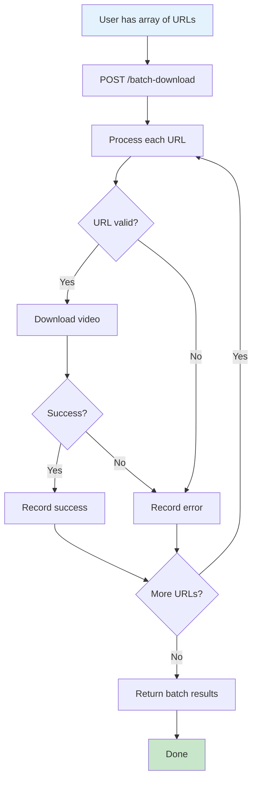
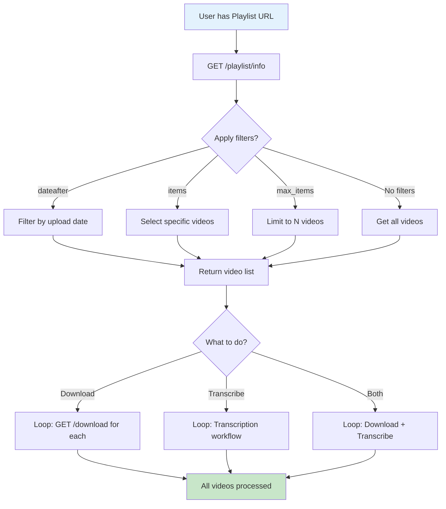
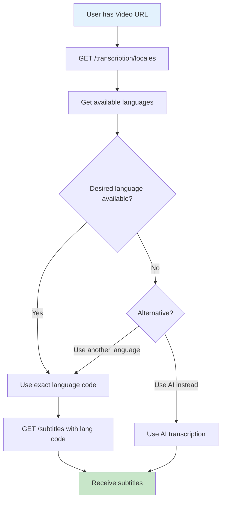
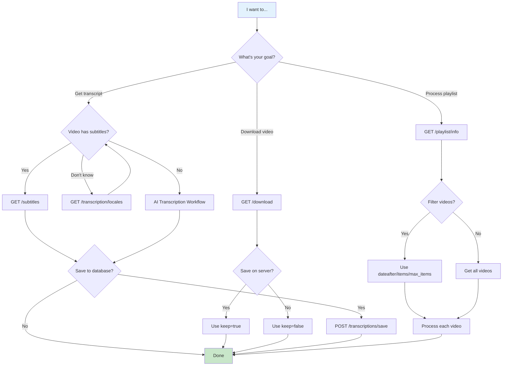

# API Usage Scenarios & Workflows

Visual flowcharts showing common usage patterns and workflows for the Social Media Video Downloader API.

## Table of Contents

**Quick Start Scenarios**
- [1. Extract Existing Subtitles](#1-extract-existing-subtitles)
- [2. AI Transcription Workflow](#2-ai-transcription-workflow)
- [3. Transcribe and Save to Supabase](#3-transcribe-and-save-to-supabase)
- [4. Smart Transcription (Subtitles First, AI Fallback)](#4-smart-transcription-subtitles-first-ai-fallback)

**Download Scenarios**
- [5. Download Single Video](#5-download-single-video)
- [6. Batch Download Multiple Videos](#6-batch-download-multiple-videos)

**Playlist & Advanced Scenarios**
- [7. Process YouTube Playlist](#7-process-youtube-playlist)
- [8. Check Available Languages Before Transcribing](#8-check-available-languages-before-transcribing)

---

## 1. Extract Existing Subtitles

**Use Case:** Quickly get transcription from a YouTube video that has existing subtitles (free & instant).



**Steps:**
1. Call `GET /subtitles?url=VIDEO_URL&format=json&lang=en`
2. API fetches video metadata and checks for subtitle availability
3. Downloads subtitle file in requested language
4. Parses and returns in requested format (json/text/srt/vtt)
5. Receive instant transcription (< 1 second)

**Cost:** $0 | **Speed:** < 1s

---

## 2. AI Transcription Workflow

**Use Case:** Transcribe video that has no existing subtitles using AI (whisperX or OpenAI).



**Steps:**
1. Call `POST /extract-audio?url=VIDEO_URL&output_format=mp3`
2. API downloads audio only (not full video) to `/tmp/`
3. Extract `audio_file` path from response (e.g., `/tmp/a3b2c1d4.mp3`)
4. Call `POST /transcribe?audio_file=/tmp/a3b2c1d4.mp3&provider=local&model_size=turbo&output_format=json`
5. AI processes audio and returns transcription with word-level timestamps
6. Receive complete transcription in unified JSON format

**Cost:** $0 (local) or $0.006/min (OpenAI) | **Speed:** 2-180s depending on video length and hardware

---

## 3. Transcribe and Save to Supabase

**Use Case:** Transcribe YouTube video and save the result to Supabase database for persistent storage.



**Steps:**
1. Try `GET /subtitles?url=VIDEO_URL&format=json` first (free & instant)
2. If no subtitles available, use AI transcription workflow:
   - `POST /extract-audio?url=VIDEO_URL`
   - `POST /transcribe?audio_file=AUDIO_PATH&output_format=json`
3. Extract transcription data from response
4. Prepare payload with `document_id` (UUID from your documents table)
5. Call `POST /transcriptions/save` with JSON body:
   ```json
   {
     "document_id": "UUID",
     "segments": [...],
     "language": "en",
     "source": "ai",
     "confidence_score": 0.95
   }
   ```
6. Transcription saved to Supabase with UPSERT (updates if exists, inserts if new)

**Requirements:** `SUPABASE_URL` and `SUPABASE_SERVICE_KEY` configured in `.env`

---

## 4. Smart Transcription (Subtitles First, AI Fallback)

**Use Case:** Optimal workflow - try free subtitles first, fallback to AI if unavailable.



**Steps:**
1. **First Attempt:** `GET /subtitles?url=VIDEO_URL&format=json&lang=en`
2. **Check Response:**
   - If `200 OK`: Use subtitle transcription (instant, free)
   - If `404 Not Found`: No subtitles available, continue to AI
3. **AI Fallback:**
   - `POST /extract-audio?url=VIDEO_URL`
   - `POST /transcribe?audio_file=AUDIO_PATH&output_format=json`
4. Receive transcription in unified JSON format (same structure for both methods)

**Optimization:** This approach saves cost and time by using free subtitles when available.

---

## 5. Download Single Video

**Use Case:** Download video file to client or save to server storage.



**Steps:**
1. Call `GET /download?url=VIDEO_URL&format=best[height<=720]&keep=false`
2. API downloads video with specified quality to temporary location
3. Video streams to client with proper filename in Content-Disposition header
4. If `keep=false`: Temporary file auto-deleted after streaming
5. If `keep=true`: File saved to `./downloads/` directory on server

**Parameters:**
- `format`: `best`, `best[height<=720]`, `best[height<=1080]`, etc.
- `keep`: `true` to save on server, `false` for temporary download

---

## 6. Batch Download Multiple Videos

**Use Case:** Download multiple videos at once with independent error handling.



**Steps:**
1. Prepare JSON payload with array of video URLs:
   ```json
   {
     "urls": ["URL1", "URL2", "URL3"],
     "format": "best[height<=720]",
     "keep": true
   }
   ```
2. Call `POST /batch-download` with payload
3. API processes each URL independently
4. One failure doesn't stop the batch
5. Receive summary response with success/failure counts:
   ```json
   {
     "total": 3,
     "successful": 2,
     "failed": 1,
     "results": [...]
   }
   ```

**Features:**
- Independent error handling per URL
- Duplicate detection (skips already downloaded)
- Automatic rate limiting between downloads

---

## 7. Process YouTube Playlist

**Use Case:** Extract playlist metadata and process individual videos.



**Steps:**
1. Call `GET /playlist/info?url=PLAYLIST_URL&dateafter=today-1week&max_items=10`
2. API extracts playlist metadata without downloading videos
3. Apply filters (optional):
   - `dateafter`: Filter by upload date (e.g., `today-1week`, `20240101`)
   - `items`: Select specific videos (e.g., `1:5`, `1,3,5,7`)
   - `max_items`: Limit number of results
4. Receive list of video URLs with metadata:
   ```json
   {
     "playlist_title": "My Playlist",
     "video_count": 10,
     "videos": [
       {"url": "...", "title": "...", "duration": "..."},
       ...
     ]
   }
   ```
5. Loop through videos and process individually:
   - Download: `GET /download?url=VIDEO_URL`
   - Transcribe: Use transcription workflow
   - Both: Download then transcribe

**Use Cases:**
- Batch download recent uploads from a channel
- Transcribe all videos in a playlist
- Monitor channels for new content

---

## 8. Check Available Languages Before Transcribing

**Use Case:** Verify which subtitle languages are available before requesting transcription.



**Steps:**
1. Call `GET /transcription/locales?url=VIDEO_URL`
2. API returns available subtitle languages:
   ```json
   {
     "title": "Video Title",
     "locales": [
       {"code": "en", "name": "English", "type": ["manual"]},
       {"code": "es", "name": "Spanish", "type": ["auto"]},
       {"code": "ara-SA", "name": "Arabic", "type": ["manual"]}
     ],
     "summary": {"total": 3, "manual_count": 2}
   }
   ```
3. Find desired language in the list
4. Use **exact code** from response (e.g., `ara-SA` for Arabic on TikTok, `ar` for Arabic on YouTube)
5. Call `GET /subtitles?url=VIDEO_URL&lang=ara-SA&format=json`
6. If desired language not available, fallback to AI transcription

**Why This Matters:**
- Language codes vary by platform (YouTube: `en`, TikTok: `eng-US`)
- Prevents 404 errors from wrong language codes
- Shows manual vs auto-generated subtitle availability

---

## Workflow Decision Tree

Quick reference for choosing the right workflow:



---

## Cost & Speed Comparison

| Workflow | Cost | Speed | Best For |
|----------|------|-------|----------|
| **GET /subtitles** | $0 | < 1s | Videos with existing subtitles (YouTube, TikTok, etc.) |
| **AI Transcription (local)** | $0 | 2-180s | Any video, runs on your server (CPU/GPU) |
| **AI Transcription (OpenAI)** | $0.006/min | 5-30s | Managed service, no hardware needed |
| **Smart Workflow** | $0 (if subtitles exist) | < 1s or 2-180s | Always try subtitles first, AI fallback |

---

## Quick Reference: Endpoint Combinations

| Use Case | Endpoints Used | Order |
|----------|---------------|-------|
| Extract subtitles | `/subtitles` | 1. Call `/subtitles` |
| AI transcription | `/extract-audio` + `/transcribe` | 1. `/extract-audio` → 2. `/transcribe` |
| Save to database | `/subtitles` OR `/transcribe` → `/transcriptions/save` | 1. Get transcription → 2. Save |
| Check languages | `/transcription/locales` → `/subtitles` | 1. Check locales → 2. Use exact code |
| Process playlist | `/playlist/info` → `/download` OR `/transcribe` | 1. Get list → 2. Loop through videos |
| Batch download | `/batch-download` | 1. Single call with array of URLs |
| Smart transcription | `/subtitles` → `/extract-audio` + `/transcribe` (fallback) | 1. Try subtitles → 2. AI if 404 |

---

**For detailed parameter documentation and response examples, see [endpoints-usage.md](endpoints-usage.md)**

**For complete endpoint reference, see [endpoints-index.md](endpoints-index.md)**
