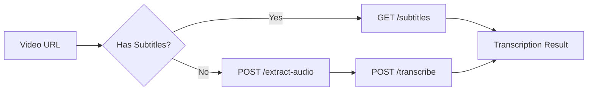

# API Endpoints Index

Quick reference guide to all available endpoints in the Social Media Video Downloader API.

## Documentation Structure

- **This File (endpoints-index.md)**: Quick reference index of all endpoints
- **[endpoints-usage.md](endpoints-usage.md)**: Detailed parameter documentation, request/response examples, integration guides
- **[endpoint-flows.md](endpoint-flows.md)**: Visual flow diagrams and step-by-step logic for each endpoint

---

## Core Endpoints

### Health & Status

| Endpoint | Method | Description | Implementation | Documentation |
|----------|--------|-------------|----------------|---------------|
| `/` | GET | Health check - returns welcome message | `main.py` | [Usage](endpoints-usage.md#1-health-check-endpoint) |

---

## Video Download

| Endpoint | Method | Description | Implementation | Documentation |
|----------|--------|-------------|----------------|---------------|
| `/download` | GET | Download videos from 1000+ platforms with quality selection | `app/routers/download.py` | [Usage](endpoints-usage.md#2-video-download-endpoint), [Flow](endpoint-flows.md#download-video) |
| `/batch-download` | POST | Download multiple videos with automatic rate limiting | `app/routers/download.py` | [Usage](endpoints-usage.md#2-video-download-endpoint) |
| `/downloads/list` | GET | List all videos saved to server storage | `app/routers/cache.py` | [Usage](endpoints-usage.md#6-list-downloads-endpoint) |

---

## Transcription & Subtitles

### Subtitle Extraction (Free & Instant)

| Endpoint | Method | Description | Implementation | Documentation |
|----------|--------|-------------|----------------|---------------|
| `/subtitles` | GET | Extract existing subtitles from videos (no processing) | `app/routers/subtitles.py` | [Usage](endpoints-usage.md#3-video-transcription-endpoint), [Flow](endpoint-flows.md#subtitle-extraction) |
| `/transcription/locales` | GET | Get available subtitle languages for a video | `app/routers/subtitles.py` | [Usage](endpoints-usage.md#4-get-available-transcription-locales-endpoint) |

### AI Transcription (whisperX / OpenAI)

| Endpoint | Method | Description | Implementation | Documentation |
|----------|--------|-------------|----------------|---------------|
| `/extract-audio` | POST | Extract audio from video URL or local file | `app/routers/audio.py` | [Usage](endpoints-usage.md#5-audio-extraction-endpoint), [Flow](endpoint-flows.md#audio-extraction) |
| `/transcribe` | POST | AI-powered transcription with multi-provider support | `app/routers/transcription.py` | [Usage](endpoints-usage.md#6-ai-transcription-endpoint), [Flow](endpoint-flows.md#ai-transcription) |

**Workflow**: `/extract-audio` → `/transcribe` → Get JSON/SRT/VTT/Text transcription

---

## Playlist & Batch Operations

| Endpoint | Method | Description | Implementation | Documentation |
|----------|--------|-------------|----------------|---------------|
| `/playlist/info` | GET | Extract playlist metadata without downloading videos | `app/routers/playlist.py` | [Usage](endpoints-usage.md#5-get-playlist-information-endpoint) |

---

## Screenshot Extraction

| Endpoint | Method | Description | Implementation | Documentation |
|----------|--------|-------------|----------------|---------------|
| `/screenshot/video` | POST | Extract screenshots from video at specified timestamps | `app/routers/screenshot.py` | [Usage](endpoints-usage.md#10-screenshot-extraction-endpoint) |

---

## Cache Management

| Endpoint | Method | Description | Implementation | Documentation |
|----------|--------|-------------|----------------|---------------|
| `/cache` | GET | List all cached files with metadata | `app/routers/cache.py` | [Usage](endpoints-usage.md#11-cache-management-endpoints) |
| `/cache/cleanup` | DELETE | Delete all cached files older than TTL | `app/routers/cache.py` | [Usage](endpoints-usage.md#11-cache-management-endpoints) |

---

## Admin & System Management

| Endpoint | Method | Description | Implementation | Documentation |
|----------|--------|-------------|----------------|---------------|
| `/admin/refresh-cookies` | POST | Manually trigger YouTube cookie refresh | `app/routers/admin.py` | Admin operations |
| `/admin/cookie-scheduler/status` | GET | Get cookie refresh scheduler status | `app/routers/admin.py` | Admin operations |
| `/admin/transcription-worker/status` | GET | Get transcription worker status | `app/routers/admin.py` | Admin operations |

**Notes**:
- Cookie refresh runs automatically every `YTDLP_COOKIE_REFRESH_DAYS` (default: 5 days)
- Manual refresh useful for testing or when auth failures occur
- Requires `YOUTUBE_EMAIL` and `YOUTUBE_PASSWORD` environment variables
- Auto-refresh triggers on YouTube auth failures (403, bot detection, etc.)

---

## Job Queue Processing (Supabase Integration)

| Endpoint | Method | Description | Implementation | Documentation |
|----------|--------|-------------|----------------|---------------|
| `/jobs/video-audio-transcription` | POST | Process transcription jobs from Supabase PGMQ queue | `app/routers/jobs.py` | [Usage](endpoints-usage.md#12-job-queue-processing-endpoint) |
| `/jobs/status` | GET | Health check for jobs endpoint with config info | `app/routers/jobs.py` | [Usage](endpoints-usage.md#12-job-queue-processing-endpoint) |

**Transcription Flow** (implemented in `app/services/job_service.py`):

```
┌─────────────────────────────────────────────────────────────────────┐
│                    Job Processing Pipeline                          │
├─────────────────────────────────────────────────────────────────────┤
│  1. Claim document (pending → processing)                           │
│  2. Validate document data (URL, media_format)                      │
│  3. Try platform subtitles first (YouTube, Vimeo, etc.)            │
│     ├── Found? → Use subtitles (faster, free, often higher quality)│
│     └── Not found? → Continue to AI transcription                   │
│  4. Extract audio from URL (only if no subtitles)                   │
│  5. Transcribe with WhisperX/OpenAI (only if no subtitles)         │
│  6. Save to document_transcriptions (source: "subtitle" or "ai")    │
│  7. Mark document completed                                         │
│  8. Ack/delete queue message                                        │
└─────────────────────────────────────────────────────────────────────┘
```

**Subtitle Extraction Priority**:
1. Manual subtitles in target language
2. Manual subtitles in English variants (en, en-US, en-GB)
3. Auto-generated captions in target language
4. Auto-generated captions in English variants
5. Fall back to WhisperX/OpenAI AI transcription

**Notes**:
- Called by Supabase Edge Functions when transcription jobs are queued
- Uses Bearer token authentication (`PY_API_TOKEN`) instead of `X-Api-Key`
- Processes jobs with automatic retry logic (up to `WORKER_MAX_RETRIES`)
- Updates Supabase `documents` table status and `document_transcriptions` on completion
- Transcription `source` field indicates origin: `"subtitle"` (platform) or `"ai"` (WhisperX/OpenAI)
- Platform subtitles support json3 (word-level timing), VTT, and SRT formats

---

## RunPod Serverless (GPU Processing)

| Endpoint | Method | Description | Implementation | Documentation |
|----------|--------|-------------|----------------|---------------|
| RunPod `/run` | POST | Async job submission to RunPod serverless | `handler.py` | [Usage](endpoints-usage.md#13-runpod-serverless-endpoint), [Deployment](runpod-deployment.md) |
| RunPod `/runsync` | POST | Synchronous job execution (waits for result) | `handler.py` | [Usage](endpoints-usage.md#13-runpod-serverless-endpoint) |
| RunPod `/status/{job_id}` | GET | Check job status and retrieve output when complete | RunPod API | [Usage](endpoints-usage.md#14-runpod-job-status-endpoint) |
| RunPod `/cancel/{job_id}` | POST | Cancel a queued or running job | RunPod API | [Usage](endpoints-usage.md#14-runpod-job-status-endpoint) |

**Notes**:
- **handler.py** is a thin orchestration layer that delegates to existing `job_service.py` and `screenshot_job_service.py`
- Receives jobs via RunPod's serverless infrastructure, not direct HTTP calls
- Supabase Edge Function calls RunPod `/run` which returns immediately
- Results are saved directly to Supabase database (no polling needed)
- See [RunPod Deployment Guide](runpod-deployment.md) for setup instructions

### RunPod Job Status Values (External API)

The `/status/{job_id}` endpoint returns these status values (provided by RunPod infrastructure):

| Status | Description | Output Available |
|--------|-------------|------------------|
| `IN_QUEUE` | Job received, waiting for worker | No |
| `IN_PROGRESS` | Worker is actively processing | No |
| `COMPLETED` | Job finished successfully | **Yes** - full results in `output` field |
| `FAILED` | Job encountered an error | Yes - error details in `output` |
| `CANCELLED` | Job was manually cancelled | No |
| `TIMED_OUT` | Job exceeded timeout limit | Yes - error details |

**Important**: When `status` is `COMPLETED`, the response includes the complete `output` field with all job results - no need to query Supabase separately if you prefer polling.

### Screenshot Jobs (RunPod Queue)

The `handler.py` supports a second queue type: `screenshot_extraction` for batch screenshot extraction jobs.

**Payload Format**:
```json
{
  "input": {
    "queue": "screenshot_extraction",
    "jobs": [{
      "video_url": "https://youtube.com/watch?v=...",
      "timestamps": ["00:00:30,000", "00:01:00,000"],
      "quality": 2,
      "document_id": "optional-uuid"
    }]
  }
}
```

**Response**:
- Each job returns a `job_id` (UUID) in the results
- Screenshots are stored to Supabase `public_media` table with job tracking metadata
- Query results directly from Supabase: `SELECT * FROM get_screenshots_by_job_id('job-uuid')`

**Job Metadata in public_media**:
- `job_id`: UUID to group screenshots from same batch
- `storage_status`: "temp" (can be confirmed later via `confirm_screenshots`)
- `job_received_at`, `job_completed_at`: Processing timestamps
- `worker`: Worker name (e.g., "runpod")

**Supabase Functions Added**:
- `get_screenshots_by_job_id(p_job_id TEXT)` - Get all screenshots for a job
- `confirm_screenshots(p_ids UUID[])` - Mark screenshots as confirmed (temp → confirmed)
- `get_expired_temp_screenshots(hours_old INTEGER)` - Preview expired temp screenshots for cleanup

**Supabase Edge Function**:
- `cleanup-temp-screenshots` - Deletes expired temp screenshots from storage and database

**Implementation Files**:
- Service: `app/services/screenshot_job_service.py`
- SQL Migration: `supabase/migrations/20251218_screenshot_jobs.sql`
- Handler: `handler.py` (queue routing logic)

### Cache Check (RunPod Queue)

The `handler.py` supports checking if a video is cached before requesting additional screenshots.

**Payload Format**:
```json
{
  "input": {
    "queue": "check_video_cache",
    "video_url": "https://youtube.com/watch?v=..."
  }
}
```

**Response**:
```json
{
  "cached": true,
  "cache_path": "/tmp/videos/abc123.mp4",
  "cache_age_seconds": 300,
  "expires_in_seconds": 1500
}
```

**Use Case**: Check if video is still cached before requesting additional screenshots. If cached, use `/runsync` for faster response. If not cached, use `/run` (async) since video needs re-download.

---

## Supabase Integration (Optional)

| Endpoint | Method | Description | Implementation | Documentation |
|----------|--------|-------------|----------------|---------------|
| `/transcriptions/save` | POST | Save transcription data to Supabase (UPSERT) | `app/routers/transcription.py` | [Usage](endpoints-usage.md#9-supabase-transcription-storage-optional), [Setup](supabase-integration.md) |
| `/transcriptions/check/{document_id}` | GET | Check if transcription exists for a document | `app/routers/transcription.py` | [Usage](endpoints-usage.md#9-supabase-transcription-storage-optional) |

---

## Quick Reference by Use Case

### Transcription Workflows



| Goal | Recommended Workflow | Cost | Speed |
|------|---------------------|------|-------|
| **Quick transcription** | `GET /subtitles` (check first) | $0 | <1s |
| **High-quality AI transcription** | `POST /extract-audio` → `POST /transcribe` (local) | $0 | 2-180s |
| **Managed AI transcription** | `POST /extract-audio` → `POST /transcribe` (openai) | $0.006/min | 5-30s |
| **Download + transcribe** | `GET /download` (keep=true) → `POST /extract-audio` (local_file) → `POST /transcribe` | $0 | Varies |

### Video Download Workflows

| Goal | Endpoint | Parameters |
|------|----------|-----------|
| **Download single video** | `GET /download` | `url`, `format`, `keep` |
| **Download playlist** | `GET /playlist/info` → loop `GET /download` | Filter by date/items |
| **Archive videos** | `GET /download` | `keep=true` |
| **Batch download** | `POST /batch-download` | Array of URLs with individual formats |

---

## Authentication

All endpoints (except `/`) require the `X-Api-Key` header:

```bash
X-Api-Key: your-api-key-here
```

Set `API_KEY` in `.env` file.

---

## Supported Platforms

1000+ platforms supported via yt-dlp including:
- **Video**: YouTube, Vimeo, DailyMotion
- **Social**: TikTok, Instagram, Facebook, Twitter/X
- **Streaming**: Twitch, YouTube Live
- **Education**: Coursera, edX, Khan Academy
- **News**: CNN, BBC, Reuters

See [yt-dlp supported sites](https://github.com/yt-dlp/yt-dlp/blob/master/supportedsites.md) for complete list.

---

## Response Formats

### Transcription Output Formats

| Format | Best For | Endpoints |
|--------|----------|-----------|
| `json` | API integration, database storage, AI processing | `/subtitles`, `/transcribe` |
| `srt` | Subtitle files, video players | `/subtitles`, `/transcribe` |
| `vtt` | Web video players (HTML5) | `/subtitles`, `/transcribe` |
| `text` | Plain text, content analysis | `/subtitles`, `/transcribe` |

### Unified JSON Response

Both `/subtitles` (format=json) and `/transcribe` (output_format=json) return the same structure:

```json
{
  "video_id": "dQw4w9WgXcQ",
  "url": "https://youtube.com/watch?v=...",
  "title": "Video Title",
  "duration": 630,
  "language": "en",
  "source": "subtitle" | "ai",
  "provider": "youtube" | "local" | "openai",
  "segments": [{"start": 0.24, "end": 3.5, "text": "..."}],
  "full_text": "Complete transcript...",
  "word_count": 245
}
```

---

## Error Handling

All endpoints return standard HTTP status codes:

| Code | Meaning | Common Causes |
|------|---------|---------------|
| `200` | Success | Request completed successfully |
| `400` | Bad Request | Missing parameters, invalid format |
| `401` | Unauthorized | Invalid or missing API key |
| `404` | Not Found | Video not found, no subtitles available |
| `500` | Server Error | Download failed, transcription error |

Error response format:
```json
{
  "detail": "Error message describing what went wrong"
}
```

---

## Rate Limits & Best Practices

- Use `/subtitles` first (free, instant) before attempting AI transcription
- Cache transcriptions to avoid repeated API calls
- Use appropriate video quality formats to minimize bandwidth
- Implement client-side timeouts for long operations
- Use `format=text` for AI processing, `format=json` for database storage

---

## Development Notes

### Modular Architecture (as of 2025-12-15)

The codebase has been refactored into a modular structure:

```
app/
├── config.py           # Configuration with pydantic-settings
├── dependencies.py     # API key verification
├── models/schemas.py   # Pydantic request/response models
├── routers/            # API endpoint modules
│   ├── download.py     # /download, /batch-download
│   ├── subtitles.py    # /subtitles, /transcription/locales
│   ├── audio.py        # /extract-audio
│   ├── transcription.py # /transcribe, /transcriptions/*
│   ├── playlist.py     # /playlist/info
│   ├── screenshot.py   # /screenshot/video
│   ├── cache.py        # /cache/*, /downloads/list
│   └── admin.py        # /admin/*
├── services/           # Business logic
│   ├── ytdlp_service.py
│   ├── cache_service.py
│   ├── supabase_service.py
│   ├── transcription_service.py
│   └── screenshot_service.py
└── utils/              # Utility functions
    ├── filename_utils.py
    ├── timestamp_utils.py
    ├── subtitle_utils.py
    ├── language_utils.py
    └── platform_utils.py
```

- **main.py**: Minimal entry point (~100 lines) that registers all routers
- When adding new endpoints, create or update the appropriate router module
- Keep endpoint-flows.md and endpoints-usage.md in sync with code changes
- Test endpoints using examples in endpoints-usage.md
- Run tests with: `pytest tests/ -v`

---

## Related Documentation

- **[CLAUDE.md](../CLAUDE.md)**: Project overview and development guide
- **[endpoints-usage.md](endpoints-usage.md)**: Complete API reference with examples
- **[endpoint-flows.md](endpoint-flows.md)**: Visual flow diagrams and logic
- **[transcription-setup-guide.md](transcription-setup-guide.md)**: AI transcription setup
- **[supabase-integration.md](supabase-integration.md)**: Database storage setup

---

**Last Updated**: 2025-12-18
**Maintainer**: Update this file when adding/modifying endpoints
